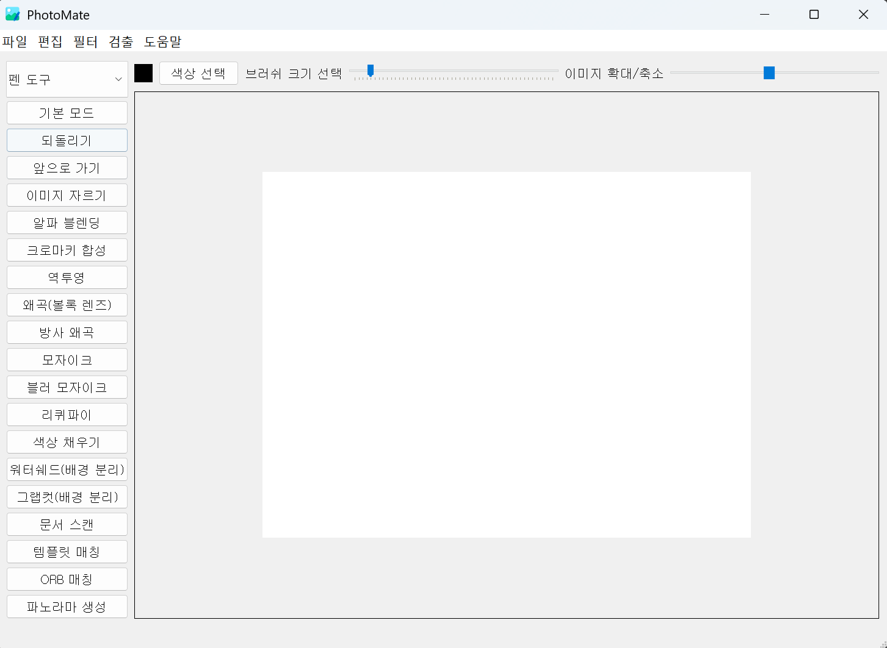

# PhotoMate - OpenCV 기반 이미지 편집 프로그램

OpenCV와 PyQt5를 활용하여 개발된 포토샵과 유사한 기능을 제공하는 이미지 편집 프로그램입니다.



## 주요 기능

### 기본 편집 기능
- **이미지 열기/저장**: PNG, JPG, BMP, GIF 등 다양한 형식 지원
- **새 파일 생성**: 사용자 지정 크기의 빈 캔버스 생성
- **되돌리기/다시 실행**: 작업 히스토리 관리
- **이미지 확대/축소**: 10% ~ 200% 스케일 조정
- **이미지 자르기**: ROI 선택을 통한 이미지 크롭

### 그리기 도구
- **펜 도구**: 자유로운 그리기
- **도형 그리기**: 선, 원, 삼각형, 사각형
- **텍스트 추가**: 사용자 지정 텍스트 입력
- **색상 선택**: 브러시 색상 및 크기 조정

### 이미지 필터 및 효과
- **흑백 변환**: 컬러 이미지를 그레이스케일로 변환
- **블러 효과**: 이미지 블러링
- **엣지 검출**: Canny 엣지 검출
- **모자이크**: 선택 영역에 모자이크 효과
- **블러 모자이크**: 블러를 이용한 모자이크 효과
- **스케치/페인팅**: 스케치 및 페인팅 효과
- **리퀴파이**: 이미지 변형 효과

### 고급 이미지 처리
- **크로마키 합성**: 배경 제거 및 합성
- **알파 블렌딩**: 이미지 혼합
- **문서 스캔**: 원근 변환을 통한 문서 스캔 효과
- **워터쉐드**: 배경과 객체 분리
- **그랩컷**: 전경과 배경 분리
- **색상 채우기**: Flood Fill 알고리즘

### 특징 검출 및 매칭
- **엣지 검출**: Canny 엣지 검출
- **코너 검출**: 시-토마스 코너 검출
- **FAST 특징 검출**: FAST 알고리즘
- **Blob 검출**: Blob 형태 검출
- **템플릿 매칭**: 이미지에서 템플릿 검색
- **ORB 매칭**: ORB 알고리즘을 이용한 특징 매칭
- **파노라마 생성**: 여러 이미지를 하나로 합성

### 모폴로지 연산
- **열림 연산**: 침식 후 팽창
- **닫힘 연산**: 팽창 후 침식
- **모폴로지 그레디언트**: 경계선 강조

### 기타 기능
- **이미지 뒤집기**: 좌우/상하 뒤집기
- **어댑티브 쓰레시홀드**: 적응적 이진화
- **정규화**: 화질 개선
- **역투영**: ROI 기반 역투영
- **왜곡 효과**: 볼록 렌즈, 방사 왜곡

## 설치 및 실행

### 필요 조건
- Python 3.7 이상
- Windows 10/11 (다른 OS에서도 실행 가능)

### 설치 방법

1. **저장소 클론**
```bash
git clone [repository-url]
cd PhotoMate
```

2. **가상환경 생성 (권장)**
```bash
python -m venv venv
venv\Scripts\activate  # Windows
# 또는
source venv/bin/activate  # Linux/Mac
```

3. **필요한 패키지 설치**
```bash
pip install -r requirements.txt
```

4. **프로그램 실행**
```bash
python main.py
```

## 프로젝트 구조

```
PhotoMate/
├── main.py              # 메인 프로그램 파일
├── requirements.txt     # 필요한 패키지 목록
├── README.md           # 프로젝트 설명서
└── icons/              # 프로그램 아이콘들
    ├── photomate.png
    ├── new_file.png
    ├── open.png
    ├── save.png
    ├── undo.png
    ├── redo.png
    ├── exit.png
    ├── info.png
    ├── grayscale.png
    ├── flip_image_horizontal.png
    └── flip_image_vertical.png
```

## 사용 방법

### 기본 사용법
1. **파일 열기**: `파일 > 열기` 또는 `Ctrl+O`
2. **새 파일**: `파일 > 새 파일` 또는 `Ctrl+N`
3. **저장**: `파일 > 저장` 또는 `Ctrl+S`

### 그리기 도구 사용
1. 좌측 사이드바에서 원하는 도구 선택
2. 색상 선택 버튼으로 브러시 색상 변경
3. 브러시 크기 슬라이더로 두께 조정
4. 이미지 위에서 마우스로 그리기

### 필터 적용
1. 좌측 사이드바에서 원하는 필터 선택
2. 일부 필터는 추가 설정이 필요할 수 있음
3. 결과를 확인하고 필요시 되돌리기 사용

### 고급 기능 사용
- **모자이크/블러 모자이크**: 도구 선택 후 이미지에서 드래그하여 영역 선택
- **워터쉐드/그랩컷**: 도구 선택 후 마우스로 영역 지정
- **파노라마**: 도구 선택 후 두 번째 이미지 파일 선택

## 키보드 단축키

- `Ctrl+N`: 새 파일
- `Ctrl+O`: 파일 열기
- `Ctrl+S`: 파일 저장
- `Ctrl+Z`: 되돌리기
- `Ctrl+Y`: 다시 실행

## 마우스 사용법

- **좌클릭 + 드래그**: 그리기, 도형 그리기, 영역 선택
- **우클릭**: 컨텍스트 메뉴 (되돌리기, 뒤집기, 저장 등)

## 기술 스택

- **Python 3.7+**: 프로그래밍 언어
- **OpenCV 4.10.0**: 컴퓨터 비전 및 이미지 처리
- **PyQt5 5.15.11**: GUI 프레임워크
- **NumPy 2.0.2**: 수치 계산

## 라이선스

이 프로젝트는 교육 목적으로 개발되었습니다.

## 개발자

**소프트웨어학과 2020E7309 김선빈**

**PhotoMate**로 창의적인 이미지 편집을 즐겨보세요!
